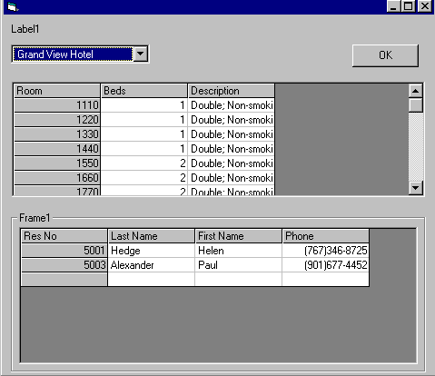



## Create a Master/Detail form

### Description

This application demostrates the creation of Master/Detail form in VB, VB programmers always felt handicapped by the fact that there was no concept of sub forms in VB but here we show how to create such forms in VB using RDO. Users are encouraged to customize the code to use ADO inplace of RDO or wait for us to write another article in which we will show you how to accomplish the same task using ADO.
 
### More Info
 
User will have to change the UserID and Password of the SQL Server in the code, see the attached document for details.

The application uses a SQL Server at the backend, the user will have to run the SQL files (included with the application) after creating a database in the SQL Server. RDO and DAO 3.51 should be present on the user's machine, these are installed when the user installs VB.

Returns a resultset that is displayed in the grid control.

             |
---                |---
**Submitted On**   |2000-07-15 17:39:38
**By**             |[Khalifa Ahmed Tarhoni](https://github.com/Planet-Source-Code/PSCIndex/blob/master/ByAuthor/khalifa-ahmed-tarhoni.md)
**Level**          |Beginner
**User Rating**    |5.0 (15 globes from 3 users)
**Compatibility**  |VB 3\.0, VB 4\.0 \(16\-bit\), VB 4\.0 \(32\-bit\), VB 5\.0, VB 6\.0, VB Script, ASP \(Active Server Pages\) 
**Category**       |[Complete Applications](https://github.com/Planet-Source-Code/PSCIndex/blob/master/ByCategory/complete-applications__1-27.md)
**World**          |[Visual Basic](https://github.com/Planet-Source-Code/PSCIndex/blob/master/ByWorld/visual-basic.md)
**Archive File**   |[CODE\_UPLOAD78557172000\.zip](https://github.com/Planet-Source-Code/khalifa-ahmed-tarhoni-create-a-master-detail-form__1-9824/archive/master.zip)

